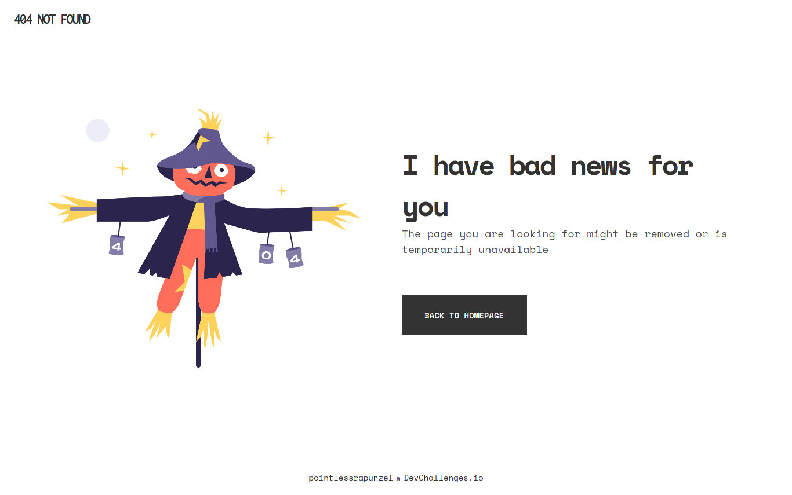

<h1 align="center">404 Not Found challenge</h1>

   Solution for a challenge from  <a href="http://devchallenges.io" target="_blank">Devchallenges.io</a>.

  <h3>
    <a href="https://{your-demo-link.your-domain}">
      Demo
    </a>
     | 
    <a href="https://{your-url-to-the-solution}">
      Solution
    </a>
     | 
    <a href="https://devchallenges.io/challenges/wBunSb7FPrIepJZAg0sY">
      Challenge
    </a>
  </h3>

## Table of Contents

- [Overview](#overview)
  - [Built With](#built-with)
- [Contact](#contact)
- [Acknowledgements](#acknowledgements)

## Overview

### Built With

HTML & SCSS :)

## Features

This application/site was created as a submission to a [DevChallenges](https://devchallenges.io/challenges) challenge. The [challenge](https://devchallenges.io/challenges/wBunSb7FPrIepJZAg0sY) was to build an application to complete the given user stories.

## Acknowledgements

- Thanks to [Thu Nghiem](https://github.com/nghiemthu) for creating this awesome platform!
- [Steps to replicate a design with only HTML and CSS](https://devchallenges-blogs.web.app/how-to-replicate-design/)

## Contact

- Website [valto.dev](https://{valto.dev})
- GitHub [@pointlessrapunzel](https://{github.com/pointlessrapunzel})
- Twitter [@lessrapunzel](https://{twitter.com/lessrapunzel})
