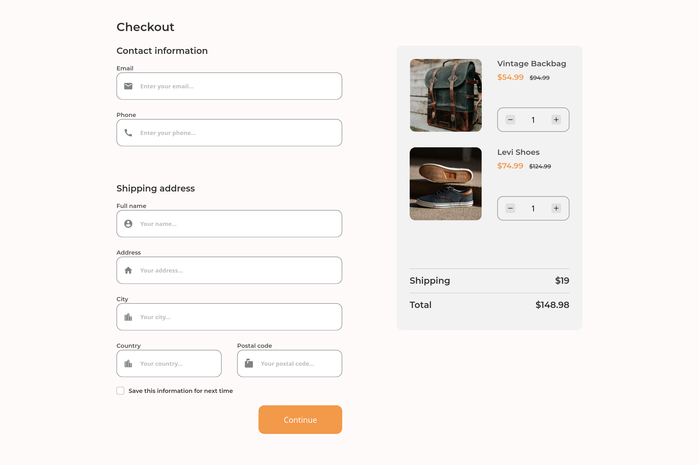
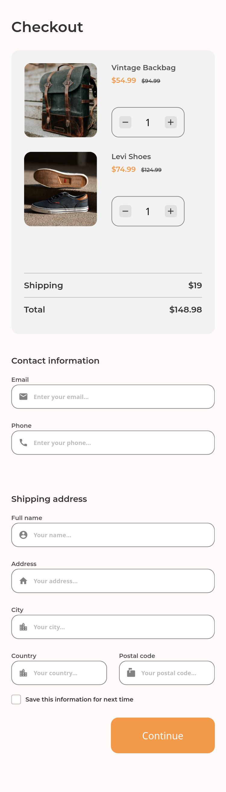

<h1 align="center">Checkout Page challenge</h1>

   Solution for a challenge from  <a href="http://devchallenges.io" target="_blank">Devchallenges.io</a>.

  <h3>
    <a href="https://pointlessrapunzel.github.io/devchallenges-io-solutions/responsive/checkout-page">
      Demo
    </a>
     | 
    <a href="https://github.com/pointlessrapunzel/devchallenges-io-solutions/tree/main/responsive/checkout-page">
      Solution
    </a>
     | 
    <a href="https://devchallenges.io/challenges/0J1NxxGhOUYVqihwegfO">
      Challenge
    </a>
  </h3>

<!-- TABLE OF CONTENTS -->

## Table of Contents

- [Overview](#overview)
  - [Built With](#built-with)
- [Features](#features)
- [Contact](#contact)
- [Acknowledgements](#acknowledgements)

<!-- OVERVIEW -->

## Overview

  
  

### Built With

HTML, SCSS and JS :)

## Features

The page is fully responsive. Features a checkout form, with an interactive cart and supports saving form info to local storage.

This application/site was created as a submission to a [DevChallenges](https://devchallenges.io/challenges) challenge. The [challenge](https://devchallenges.io/challenges/0J1NxxGhOUYVqihwegfO) was to build an application to complete the given user stories.

## Acknowledgements

- Thanks to [Thu Nghiem](https://github.com/nghiemthu) for creating [Devchallenges.io](https://devchallenges.io/challenges), such an awesome platform!

## Contact

- Website [valto.dev](https://{valto.dev})
- GitHub [@pointlessrapunzel](https://{github.com/pointlessrapunzel})
- Twitter [@lessrapunzel](https://{twitter.com/lessrapunzel})
