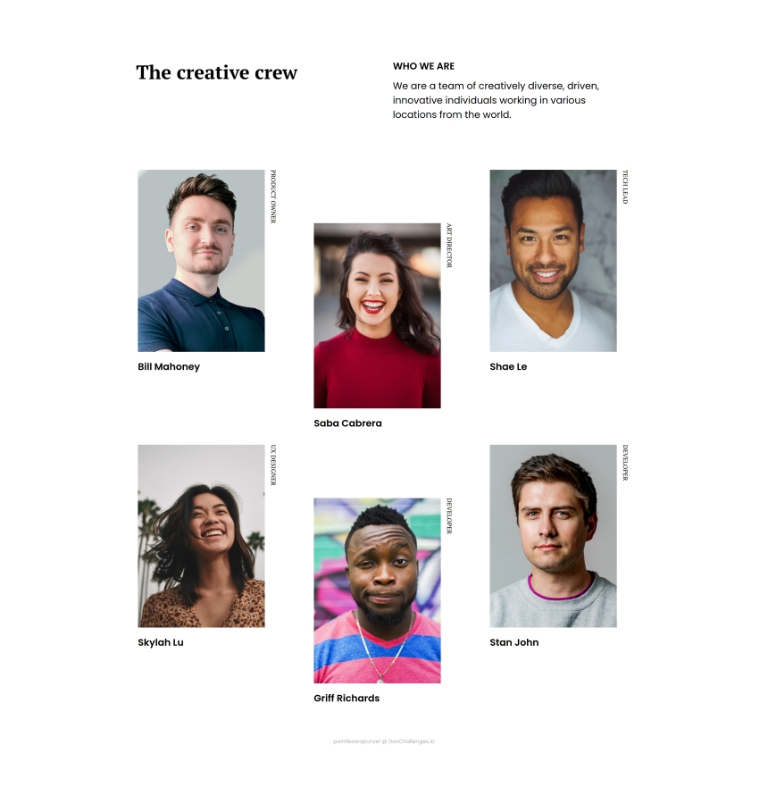
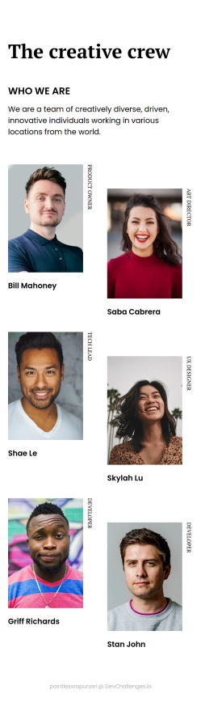

<h1 align="center">My team page</h1>

   Solution for a challenge from  <a href="http://devchallenges.io" target="_blank">Devchallenges.io</a>.

  <h3>
    <a href="https://pointlessrapunzel.github.io/devchallenges-io-solutions/responsive/my-team-page">
      Demo
    </a>
     | 
    <a href="https://github.com/pointlessrapunzel/devchallenges-io-solutions/tree/main/responsive/my-team-page">
      Solution
    </a>
     | 
    <a href="https://devchallenges.io/challenges/hhmesazsqgKXrTkYkt0U">
      Challenge
    </a>
  </h3>

## Table of Contents

- [Overview](#overview)
  - [Built With](#built-with)
- [Features](#features)
- [Contact](#contact)
- [Acknowledgements](#acknowledgements)

## Overview

   
    

### Built With

- HTML
- SCSS

## Features

This application/site was created as a submission to a [DevChallenges](https://devchallenges.io/challenges) challenge. The [challenge](https://devchallenges.io/challenges/hhmesazsqgKXrTkYkt0U) was to build an application to complete the given user stories.

The page is fully responsive, coded with a mobile-first approach.

## Acknowledgements

- Thanks to [Thu Nghiem](https://github.com/nghiemthu) for creating [Devchallenges.io](https://devchallenges.io/challenges), such an awesome platform!
- [Steps to replicate a design with only HTML and CSS](https://devchallenges-blogs.web.app/how-to-replicate-design/)
- [Marked - a markdown parser](https://github.com/chjj/marked)

## Contact

- Website [valto.dev](https://{valto.dev})
- GitHub [@pointlessrapunzel](https://{github.com/pointlessrapunzel})
- Twitter [@lessrapunzel](https://{twitter.com/lessrapunzel})
